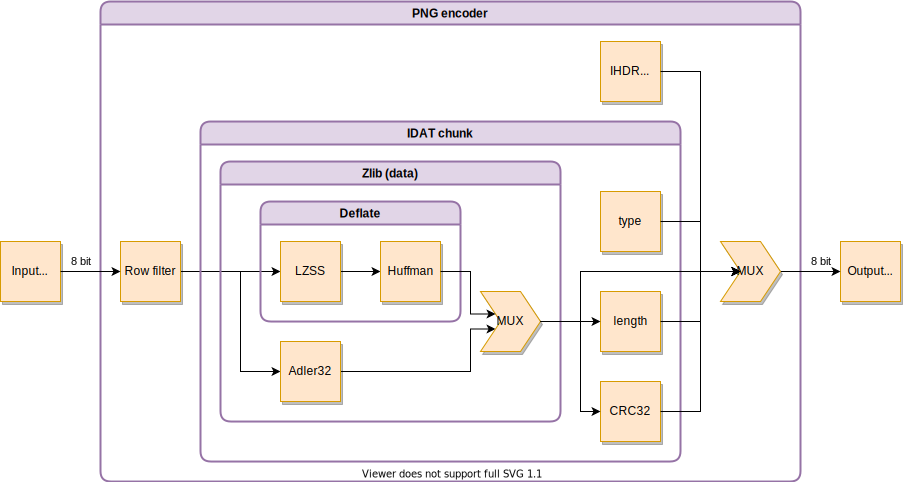

# pico-png

[](https://github.com/marph91/pico-png/actions?query=workflow%3Atests)
[](https://github.com/marph91/pico-png/actions?query=workflow%3Asynthesis)

`pico-png` is a VHDL implementation of a PNG encoder, as specified in [ISO/IEC 15948:2003](https://www.w3.org/TR/2003/REC-PNG-20031110/). It includes a deflate compression according to [RFC1950](https://www.ietf.org/rfc/rfc1950.txt) and [RFC1951](https://www.ietf.org/rfc/rfc1951.txt).

## Features

- Row filter types: no filter, subtraction filter
- Color types: gray, RGB, gray + alpha, RGBA
- Zlib compression: fixed huffman tables

For details about the configuration, see [here](doc/toplevel_interface.md).

## Limitations

- Fixed huffman tables only
- Small input and search buffers (LZSS)
- Only the first match is considered (LZSS)

## Architecture overview



## Stats

### Comparison with IPB-PNG-E

[IPB-PNG-E](https://ipbloq.files.wordpress.com/2017/09/ipb-png-e-pb.pdf) is a commercial IP-Core to encode an raw image to PNG. It is the only one I could find with some stats for comparison. If there are any other cores with stats, please contact me.

|Property|IPB-PNG-E|pico-png|
|:-|:-:|:-:|
|Image size|800x480 pixel|800x480 pixel|
|Color type|24-bit RGB|24-bit RGB|
|Row filter type|?|no filter|
|Zlib compression|fixed huffman tables|fixed huffman tables|
|Latency|12.5 ms|53.2 ms at 100 MHz|
|Target FPGA|Kintex-7|Kintex-7|
|Slices|3490|507 (1577 LUT, 741 FF)|
|BRAM|2 Mbit|-|
|DSP|8|-|
|Worst negative slack|?|0.470 ns|

### Comparison with Imagemagick

For another comparison, the same input image as above was used. The image data was generated as ones only, which means there should be almost the maximum compression. There were no additional settings. This is the snippet used to create the imagemagick reference:

```bash
python3 -c 'with open("800x480_rgb.raw", "wb") as outfile: outfile.write(bytes([1]*800*480*3))'
convert -size 800x480 -depth 8 rgb:800x480_rgb.raw png24:800x480_rgb.png
wc --bytes 800x480_rgb.raw 800x480_rgb.png
```

The image of `pico-png` is a simulation output from `pico-png/sim/png_encoder/gen/test_img_ones_800x480_row_filter_0_color_2_btype_1.png`.

|Property|Imagemagick|pico-png|
|:-|:-:|:-:|
|Image size|800x480 pixel|800x480 pixel|
|Image depth|24-bit RGB|24-bit RGB|
|Raw image size (kbyte)|1152|1152|
|Encoded image size (kbyte)|2.4|282.8|

The encoded image size of imagemagick is much smaller than `pico-png`. This is as expected, because `pico-png` uses only a small window size of 12 values. Imagemagick uses most likely the default window size of 32k values. However, the table shows that a reduced image size is achieved in both cases.

## Tests

To run the testbench, simply execute `cd sim && ./run_all.py -p4`.

## Similar projects and further links

- <https://github.com/tomtor/HDL-deflate>: Deflate (de)compression in MyHDL.
- <https://hal-upec-upem.archives-ouvertes.fr/hal-01305864/document>
- <http://www.ece.ualberta.ca/~jhan8/publications/1570528606.pdf>
- <https://zenodo.org/record/3679358>
